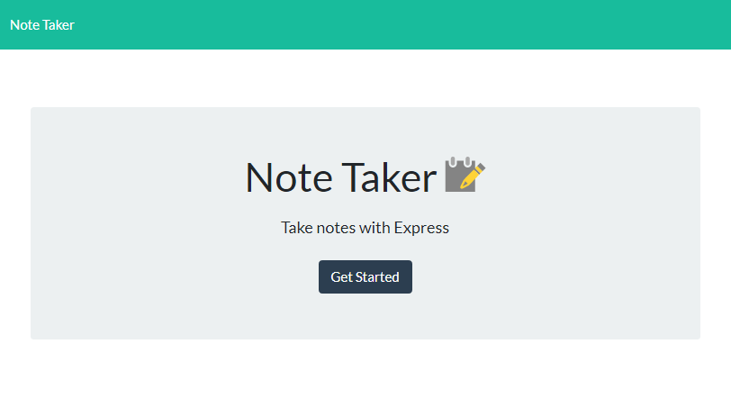
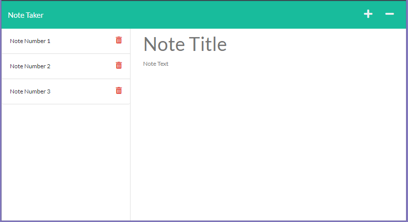
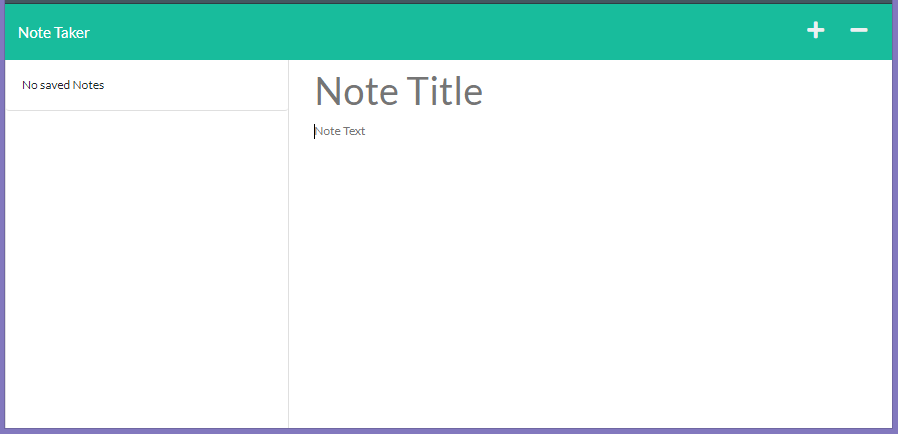

#  NoteTaker
NoteTaker Tool 
  
  
  Please use the following link to see published version of this repository https://xtended99.github.io/NoteTaker/   
  
  The home for this project lives at the following link at GitHub https://github.com/Xtended99/NoteTaker   
  
  Heroku Access https://calm-bayou-08090.herokuapp.com/
  
  This assignment is to create a tool that will allow a user to add, delete and save mesages to a remote server.  
     
  
    Introductory screen of this tool.   

   

### Instalation and Run Time Instructions:

-   1. Select or create a directory you would like to install the tool into.   
-   2. cd into the selected or newly created directory   
-   3. Run the following command git clone git@github.com:Xtended99/NoteTaker.git
-   4. After the download execute npm install.   
-   5. To start the application type the following npm run start
-   6. First screen is the introduction and it looks like this:

   

-   7. Then select Get Started button. The next selection look s like this   
   
   
   
-   8. The trashcan permits you to delete a note   
-   9. The + sign allows you to add a note    
-   10. The - sign permits you to delete a note
-   11. The the floppy disk image will appear once you fill in the Mote Tilte and the note text.
      At that point you will be able to commit you notes to disk on tremote end,
  
   
  
### Given:

Your assignment is to modify starter code to create an application called Note Taker that can be used to write and save   
notes. This application will use an Express.js back end and will save and retrieve note data from a JSON file.   

The application’s front end has already been created. It's your job to build the back end, connect the two, and then   
deploy the entire application to Heroku.   

AS A small business owner   
I WANT to be able to write and save notes SO THAT I can organize my thoughts and keep track of tasks I need to complete   

### Acceptance Criteria

-   GIVEN a note-taking application
-   WHEN I open the Note Taker
-   THEN I am presented with a landing page with a link to a notes page
-   WHEN I click on the link to the notes page
-   THEN I am presented with a page with existing notes listed in the left-hand column, plus empty fields to enter a new note title and the note’s text in the right-hand column
-   WHEN I enter a new note title and the note’s text
-   THEN a Save icon appears in the navigation at the top of the page
-   WHEN I click on the Save icon
-   THEN the new note I have entered is saved and appears in the left-hand column with the other existing notes
-   WHEN I click on an existing note in the list in the left-hand column
-   THEN that note appears in the right-hand column
-   WHEN I click on the Write icon in the navigation at the top of the page
-   THEN I am presented with empty fields to enter a new note title and the note’s text in the right-hand column

Your task is to build a Node.js command-line application that takes in information about employees on a software   
engineering team, then generates an HTML webpage that displays summaries for each person. Testing is key to making   
code maintainable, so you’ll also write a unit test for every part of your code and ensure that it passes each test.  
  
Because this application won’t be deployed, you’ll need to provide a link to a walkthrough video that demonstrates  
its functionality and all of the tests passing. You’ll need to submit a link to the video AND add it to the readme of your project.
  
**Note**: There is no starter code for this assignment.
     
-   The application will be invoked by using the following command:   
   
-   node index.js   
   
-   Because this application won’t be deployed, you’ll also need to provide a link to a walkthrough video that   
-   demonstrates its functionality. Revisit the Screencastify Tutorial in the prework as a refresher on how to   
-   record video from your computer. You’ll need to submit a link to the video _and_ add it to the README of your project.   
   
   
### Experience the user should expect - User Story:   
   
- AS A manager I WANT to generate a webpage that displays my team's basic info SO THAT I have quick access to their emails and GitHub profiles  
    
### Website incorporated feature sets and expectations - Acceptance Criteria:  
  
- GIVEN a command-line application that accepts user input  
- WHEN I am prompted for my team members and their information  
- THEN an HTML file is generated that displays a nicely formatted team roster based on user input  
- WHEN I click on an email address in the HTML  
- THEN my default email program opens and populates the TO field of the email with the address  
- WHEN I click on the GitHub username  
- THEN that GitHub profile opens in a new tab  
- WHEN I start the application  
- THEN I am prompted to enter the team manager’s name, employee ID, email address, and office number  
- WHEN I enter the team manager’s name, employee ID, email address, and office number  
- THEN I am presented with a menu with the option to add an engineer or an intern or to finish building my team  
- WHEN I select the engineer option  
- THEN I am prompted to enter the engineer’s name, ID, email, and GitHub username, and I am taken back to the menu  
- WHEN I select the intern option  
- THEN I am prompted to enter the intern’s name, ID, email, and school, and I am taken back to the menu  
- WHEN I decide to finish building my team  
- THEN I exit the application, and the HTML is generated  
  
## Mock-Up

The following images show the web application's appearance and functionality: 

## Getting Started

The application should have a `db.json` file on the back end that will be used to store and retrieve notes using the `fs` module.

The following HTML routes should be created:

* `GET /notes` should return the `notes.html` file.

* `GET *` should return the `index.html` file.

The following API routes should be created:

* `GET /api/notes` should read the `db.json` file and return all saved notes as JSON.

* `POST /api/notes` should receive a new note to save on the request body, add it to the `db.json` file, and then return the new note to the client. You'll need to find a way to give each note a unique id when it's saved (look into `npm` packages that could do this for you).

## Bonus

You haven’t learned how to handle DELETE requests, but this application has that functionality in the front end. As a bonus, see if you can add the DELETE route to the application using the following guideline:

* `DELETE /api/notes/:id` should receive a query parameter containing the id of a note to delete. In order to delete a note, you'll need to read all notes from the `db.json` file, remove the note with the given `id` property, and then rewrite the notes to the `db.json` file.

## Grading Requirements

This homework is graded based on the following criteria: 

### Technical Acceptance Criteria: 40%

* Satisfies all of the preceding acceptance criteria plus the following:

  * Application front end must connect to an Express.js back end.

  * Application back end must store notes with unique IDs in a JSON file.

  * Application must be deployed to Heroku.

### Deployment: 36%

* Application deployed at live URL.

* Application loads with no errors.

* Application GitHub URL submitted.

* GitHub repository contains application code.

### Application Quality: 11%

* Application console is free of errors.

### Repository Quality: 13%

* Repository has a unique name.

* Repository follows best practices for file structure and naming conventions.

* Repository follows best practices for class/id naming conventions, indentation, quality comments, etc.

* Repository contains multiple descriptive commit messages.

* Repository contains quality README file with description, screenshot, and link to deployed application.

### Bonus: +10 Points

* Application allows users to delete notes.

## Review

You are required to submit BOTH of the following for review:

* The URL of the functional, deployed application.

* The URL of the GitHub repository. Give the repository a unique name and include a README describing the project.
